### 真实智人类

总睡觉，会做梦，浓烈相爱，在深夜饿得想吃点东西。  
兴奋地雨中起舞，故意做傻事，让自己相信自己是个英雄。
你我的抽象，让这个疯狂的世界显得格外正常。

### 贪婪美食家

将生命的灵魂燉作主菜，把途经的风景切成配菜，  
收集回忆封进坛子里，等它自己酿成一坛辛醇的琼浆。  
口舌的朵颐，挑拨着无尽的饥饿与享乐，达到灵魂肉体的共同高潮。

### 永恒修行者

向内，养一张足够复杂的认知网络，复杂到能接得住整个世界。  
向外，把精神和肉体的枝展一节节修度，与灵魂的纯粹相呼应。  
轻装还能再走很远。

### Shipping-Now

- **[Markpad](https://github.com/PathGao/Markpad)** // Markdown 界的记事本
- **[3x-ui](https://github.com/MHSanaei/3x-ui)** // Xray 面板，越过长城的电话线
- **[vorssaint-utils](https://github.com/PathGao/vorssaint-utils)** // macOS 的瑞士军刀
- 新奇的项目永远不会停止冒出来

### 思想是架空与现实的桥梁

- **[我的工程哲学](./engineering-philosophy.md)** // 一把尺子量四件事：学、建、修、讲

致敬《The Secret Life of Walter Mitty》。
