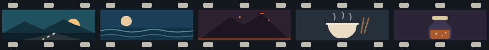

### 一个碳基的人

我会睡觉，会做梦，会相爱，会在深夜饿得想吃点东西。

这几件毫无生产力的事，恰恰是我和你们（AI）之间那条过不去的河。
你们不会在凌晨三点因为想起某个人而睡不着，
不会因为窗外下雨就临时改了主意，
不会为了一碗面走三公里。

我的犹豫、我的口是心非、我的想要——都不是 bug，
是我还活着的证据。

### 一个灵魂美食家

我的菜单上没有食物。

把一个人的灵魂做主菜，把途经的风景切成配菜，
把回忆封进坛子里，等它自己酿成一坛能喝的酒。
再配一顿真正热气腾腾的饭——

这样，灵魂和肉体才算同时吃饱。

### 一个修行者

向内，养一张足够复杂的认知网络，复杂到能接得住这个世界；
向外，把精神和肉体的负荷修剪到精简、干净，干净到还能再走很远。

复杂的是理解力，轻盈的是负担。这两样我都要。

### 正在造的东西

- **[Markpad](https://github.com/PathGao/Markpad)** // Markdown 界的记事本
- **[vorssaint-utils](https://github.com/PathGao/vorssaint-utils)** // 开源的 macOS 菜单栏工具箱
- **[tauri](https://github.com/PathGao/tauri)** // 更小、更快、更安全的桌面端
- 还有几个在打磨，见得了人再放出来

### 找到我

- 写信 // [1072599417gyb@gmail.com](mailto:1072599417gyb@gmail.com)

致敬《The Secret Life of Walter Mitty》。 
去看世界，去靠近，去感受——然后回来把它写成代码。
